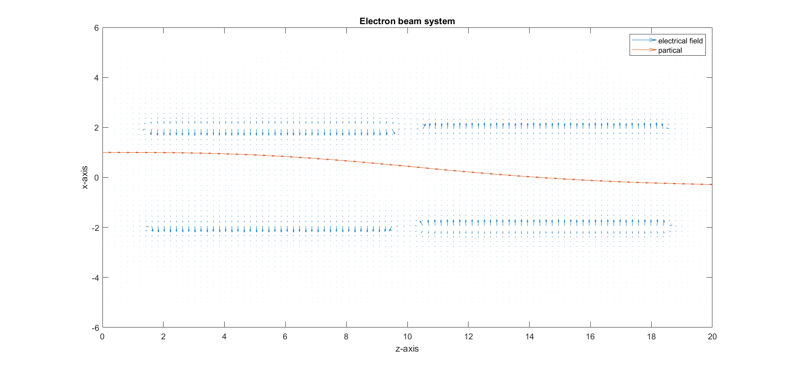

# electron-beam
simulate electron beam systems
## Introduction
A simple simulator for electron beam
### Environment
This electron beam system comprises an x-selector composed of two capacitors positioned on the left and right sides respectively. Each capacitor comprises a pair of plates. Each plate contains numerous electrons capable of generating an emitted electrical field into space. Subsequently, the superimposed electrical fields generated by the two pairs of plates are applied within the space.
### Initial state
The rejected particle possesses only an initial velocity along the z-axis. It will be released from the origin along the z-axis but from any point along the x-axis.
### Result

The particle's trajectory shifts by the presence of the electrical field in space.
### Outlook
The system would be constructed, which includes one x_selector and one y_selector through 3-dimensions.

### Todo
- [x] x-selector
- [x] 2D to 3D
- [x] combined with y-selector
- [ ] plot electron position and charge (by different colors).
- [ ]  complete comments
- [ ] plot x-z plane and y-z plane.
- [ ] convert to python
- [ ] write python unit test and test automation with github action.